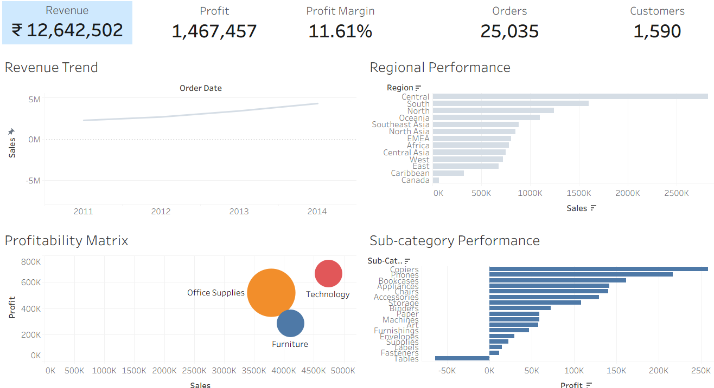
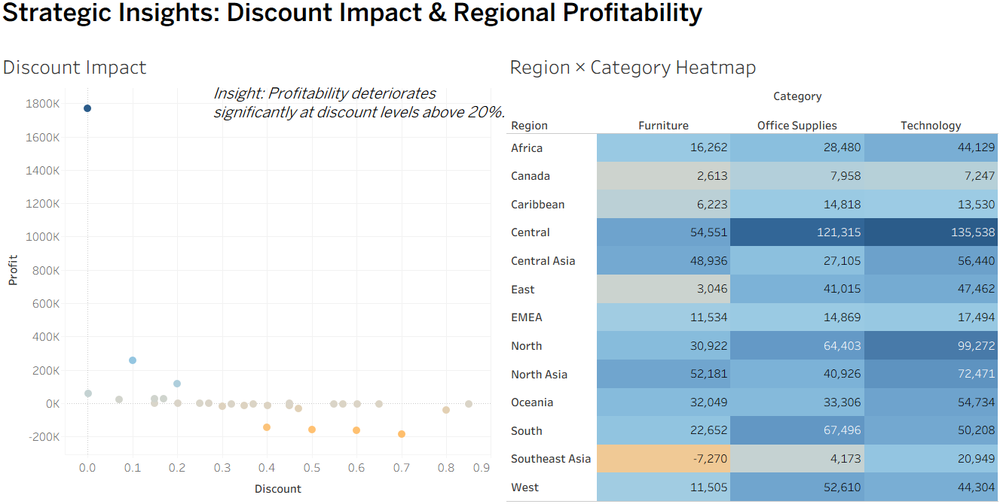

# Executive360 – Retail Intelligence & Strategic Decision Platform

## Objective
A global retail company experienced strong sales growth but inconsistent profitability. This centralized analytics platform was built to identify which markets deserve further investment, how discounts impact margins, and which sub-categories reduce overall profitability. 

## Tech Stack
*   **Data Preparation & Analysis:** SQL
*   **Data Visualization:** Tableau 
*   **Key Techniques:** Coordinate-based dashboard layout, KPI development, profitability mapping, visual hierarchy.

## Key Strategic Insights

### 1. The 20% Discount Cliff
Through SQL analysis and visual plotting, it was discovered that applying discounts greater than **20%** severely degrades profitability. Sub-categories relying on heavy discounting to drive sales volume are actively operating at a loss. 

### 2. Sub-Category Performance Gaps
While "Technology" remains the most profitable category, specific sub-categories like "Tables" and "Bookcases" are operating at significant losses despite high sales volumes. This indicates a need to restructure pricing or vendor agreements in the Furniture sector.

## Dashboards

### Executive Overview
This dashboard provides a high-level summary of business health, tracking revenue trends, regional performance, and matrixed profitability. 

### Strategic Insights
This deep-dive dashboard highlights the direct correlation between excessive discounting and profit loss, alongside a granular region-by-category profitability heatmap.

---
**Author:** Mohak Seth
